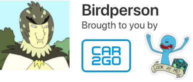
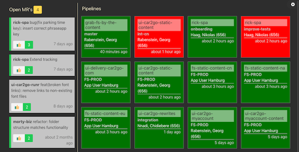

Birdperson is a clientside-only webapp to monitor your (or your team's) open merge requests and pipeline status on GitLab. It works with both the GitLab.com and the self-hosted version.

It is written in Angular 5.2 and originally intended to be used as a dashboard on a big screen TV, running on a Raspberry Pi 3 (though it could probably be used in several other ways...)

## How does it look like



## How does it work

1.  It saves your settings (GitLab domain, accessToken) in LocalStorage.
2.  It pings the GitLab API every 30 seconds / 1 minute to retrieve the latest data from there, and then updates the dashboard items.

## How do I use it?

1.  Fork and/or clone this repo.
2.  Run `npm run build`.
3.  Serve the `/dist` folder (e.g. using `http-server`).
4.  Generate a new accessToken (with the appropiate permissions) at your GitLab's `/profile/personal_access_tokens` page and copy it.
5.  Enter your settings (your GitLab domain, the accessToken you just generated, etc)

## How do I improve / tweak / break it...?

This project was generated with [Angular CLI](https://github.com/angular/angular-cli) version 1.7.1, so the regular Angular CLI stuff should work.

In case you're anxious to get hackin':

### Dockerless

1.  Make sure you are running on Node.js 8.9 or above (you can run `nvm use`)
2.  Run `npm start` for a dev server, the navigate to `http://localhost:4200/`. The app will automatically reload if you change any of the source files.
3.  Write some code!

### Dockerfull

1.  Run `docker-compose up`.
2.  Write some code!

## Who did this thing?

Birdperson is built and maintained by Team Meeseeks, the resident Customer Web Team at Car2Go in Hamburg, Germany.

## License

```
Copyright (c) 2018 car2go group GmbH

Released under the MIT license.

Permission is hereby granted, free of charge, to any person obtaining a copy of this software and associated documentation files (the "Software"), to deal in the Software without restriction, including without limitation the rights to use, copy, modify, merge, publish, distribute, sublicense, and/or sell copies of the Software, and to permit persons to whom the Software is furnished to do so, subject to the following conditions:

The above copyright notice and this permission notice shall be included in all copies or substantial portions of the Software.

THE SOFTWARE IS PROVIDED "AS IS", WITHOUT WARRANTY OF ANY KIND, EXPRESS OR IMPLIED, INCLUDING BUT NOT LIMITED TO THE WARRANTIES OF MERCHANTABILITY, FITNESS FOR A PARTICULAR PURPOSE AND NONINFRINGEMENT. IN NO EVENT SHALL THE AUTHORS OR COPYRIGHT HOLDERS BE LIABLE FOR ANY CLAIM, DAMAGES OR OTHER LIABILITY, WHETHER IN AN ACTION OF CONTRACT, TORT OR OTHERWISE, ARISING FROM, OUT OF OR IN CONNECTION WITH THE SOFTWARE OR THE USE OR OTHER DEALINGS IN THE SOFTWARE.
```
